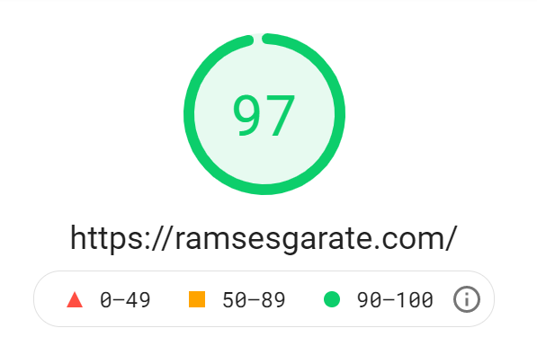
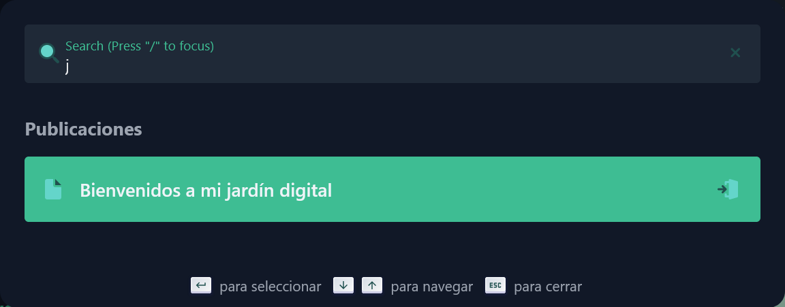
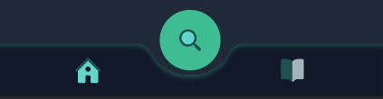

Bienvenidos a mi pagina web, o mejor dicho, a mi Jardín Digital, la idea de tener un jardín digital es crear un espacio en línea en la interrelación de un cuaderno y un blog, donde los jardineros digitales comparten semillas de pensamientos para cultivar en público. A diferencia de un blog, donde los artículos y ensayos tienen una fecha de publicación y comienzan a decaer tan pronto como se publican, un jardín digital es siempre verde: los jardineros digitales siguen editando y refinando sus notas.

Desde hace un tiempo quería lanzar mi página web, sin embargo, nunca le dedique el tiempo suficiente, nunca estaba satisfecho con el diseño o estaba enfocado en tener un performance de 100%, ya casi estamos a mitad de año y seguía sin web, decidí que este año o lo que queda de año iba a ser diferente. A lo largo de este post le voy a contar un poco de los objetivos de mi pagina, las tecnologías que use, estructura de componentes, sobre algunos componentes puntuales que me gustaron mucho, entre otras cosas.

## Objetivo

Mi objetivo principal es crear un medio para reforzar lo que he aprendido y estoy aprendiendo, escribir cosas de las que me hubiera beneficiado en el pasado; mejorar mi redacción, perder ese miedo a escribir o a explicar un tema; crear un portafolio para demostrar mis habilidades y por ultimo pero no menos importante, ayudar a las personas que vienen después de mí con recursos técnicos y tutoriales.

## Tecnologías

Para mi pagina decidí usar las siguientes tecnologías:

- Gridsome: [Gridsome](https://gridsome.org/) es un framework Jamstack (JavaScript, APIs y Markup) basado en Vue.js para crear sitios web de forma estática.

- Tailwind: [Tailwind](https://tailwindcss.com/) es un framework CSS que proporciona una serie de utilidades de bajo nivel que nos permite crear diseños completamente personalizados en base a la composición de clases.

- Netlify: [Netlify](https://netlify.com/) un servicio de hosting para sitios web estáticos, optimiza los recursos del proyecto automáticamente y la integración continua se activa con las implementaciones del repositorio de Git.

El framework de JavaScript que dominó es Vue.js, así que decidí que una buena manera de demostrar mis habilidades era creando mi web con él.

## Estructura de componentes

Lamentablemente Vue.js no tiene una estructura de componentes definida, así que tuve que indagar durante varios días cuál era la estructura ideal o que mejor se adaptaría a mi proyecto, al final terminó gustándome la metodología Atomic Design, ¿Por que? Todas las páginas, realmente son un compendio de componentes, es decir, los componentes son los que forman las pantallas, y estos componentes pueden estar compuestos por otros componentes más pequeños, les dejo una breve explicación de su creador Brad Frost:

> "Las interfaces están formadas por componentes más pequeños. Esto significa que podemos dividir interfaces enteras en bloques de construcción fundamentales y trabajar desde allí. Esa es la esencia básica del diseño atómico".

Entonces, Atomic Design es un sistema de diseño que se basa en la creación de elementos modulares sencillos para crear estructuras de información mucho más complejas.

Hay cinco niveles distintos en el diseño atómico, no las explicare en detalle, pero si las voy a enumerar:

- Atoms.
- Molecules.
- Organism.
- Templates.
- Pages.

## Velocidad

Realmente quería que mi sitio fuese extremadamente rápido, era algo muy importante para mí, odio cuando espero más de 3 seg. por una página, por eso recomiendo encarecidamente usar [Gridsome](https://gridsome.org/) o un generador de sitios estáticos y [Netlify](https://netlify.com/).

El mejor resultado que pude obtener en las pruebas de pagespeed fue 97, realmente no quería enfocarme en llegar a 100, con estar por encima de 90 era suficiente para mi.

Cosas que ayudaron, usar un generador de sitios estáticos, optimizar las imágenes, tener lo esencial y no agregar muchas dependencias de terceros, esto ha mantenido el sitio extremadamente rápido.

## Open Source

Una de mis metas como desarrollador es comenzar a involucrarme más en la comunidad y colaborar en proyectos open source, por ende, mi primer paso era dejar libre el código de mi proyecto para que otras personas lo puedan usar como un template y modificar lo que gusten a su conveniencia. Les dejo el link del [repositorio ramsesgarate.com](https://github.com/ramsesgarate/ramsesgarate.com).

## Componentes

Hay una serie de componentes que desarrolle y me gustaron mucho, entre ellos se encuentran los siguientes:

### Buscador

Todo blog debe tener un buscador, sin embargo, yo quería que este, se pudiera acceder desde cualquier lugar de la página y poder realizar buscar entre todas las publicaciones, así que cree un componente llamado `ModalSearch.vue` que está compuesto por un input y una lista con los resultados, algo interesante fue agregar que se pudiera navegar entre los resultado, entrar o cerrar el modal con el teclado, esto lo explicare en un post próximamente, mientras les dejo el resultado.

### Menú Mobile

Usualmente en la versión mobile de una aplicación o un landing page se usan menú de hamburguesas, pero hay aplicaciones que tienen un menu de navegacion mobile, es decir, una barra de navegación en la parte inferior de la pantalla, realmente esto siempre me ha gustado, así que mi sitio tenía que tener uno, era simple y efectivo, ademas, le agregue al medio un botón para poder levantar el `ModalSeach.vue`.

### Botón Compartir

Cuando se piensa en una función compartir contenido se suele crear una función para cada red social o plataforma, sin embargo, el navegador tiene una API llamada `Navigator.share()` que permite usar el mecanismo de uso compartido nativo del dispositivo, así que me aproveche de este y lo integre con un botón, si el navegador tiene soporte a la api hace uso de ella, como dije, muchos navegadores no tienen soporte, así que deje por default compartir en Twitter, proximamente agregare mas opciones.

## Conclusión

Disfruté mucho haciendo esto y todavía me falta mucho más por hacer para que esté como lo imagino, pero quería publicar una primera parte, que las personas me den un feedback y que vayan viendo como va evolucionando, no creo que la interfaz cambie mucho, pero si tengo pensado agregarle otras funcionalidades.

Esta fue mi primera publicación y espero pronto estar compartiendo la siguiente.
